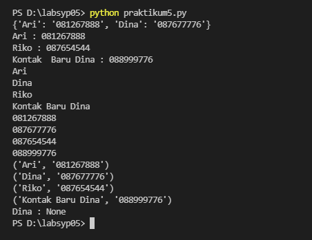

# Latihan 
## Dictionary 
Dictionary merupakan struktur data yang anggotanya terdiri dari key:value. Sama seperti set, dictionary juga tidak memiliki indeks dan bersifat unordered (tidak berurutan).
### Membuat Daftar Kontak 
pertama-tama kita membuat Dictionary dengan langsung di akses 

hasil output nya 
#### Output

#### Menampilkan kontak Ari 
#### Menambahkan Kontak Riko 
#### Mengubah Kontak Dina 

kali ini kita menggunakan syntax seperti ini 

#### Output 

#### Menampilkan Semua Nama dan Nomer 
#### Menampilkan Daftar Nama dan Nomer

syntax yang saya gunakan menggunakan for 

#### Output 

#### Menghapus kontak Dina 

Untuk menghapus anggota dictionary kita dapat menggunakan perintah del ataupun fungsi pop(). coba kita gunakan pop()

#### Output

## Gambar codingan dan output

